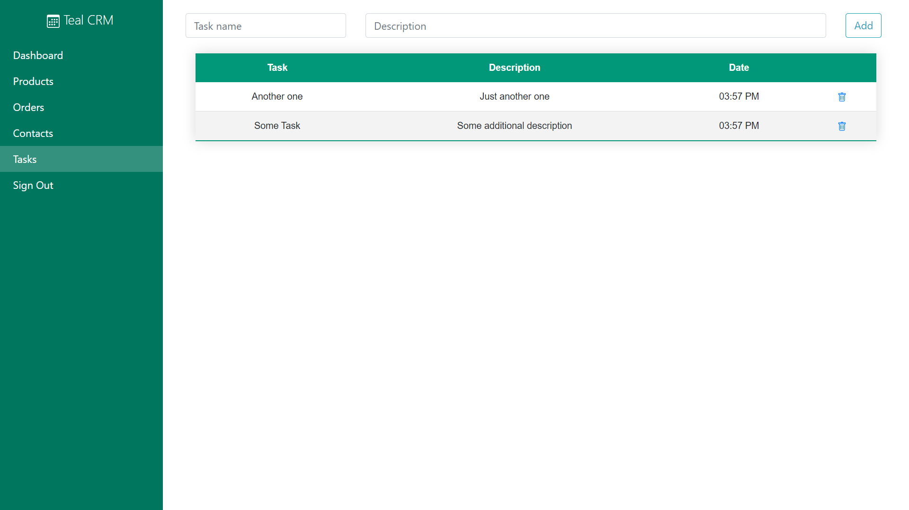

# Dj CRM

A Django CRM in which you can create, update or delete Product, Orders and Contacts. You can also filter and search. You can also add task for reminder.

+  Create, update or delete Product, Orders and Contacts.
+  Search and filter.
+  Add todo tasks for reminder.

### Screenshots

<table>
  <tr>
  <td align="center">
      <a href="https://github.com/nimadorostkar/DjangoCRM/blob/master/screenshots/login.png">
        
      </a>
      <br />
      <p>Login Page</p>
    </td>
    <td align="center">
      <a href="https://github.com/nimadorostkar/DjangoCRM/blob/master/screenshots/dashboard.png">
        
      </a>
      <br />
      <p>Dashboard</p>
    </td>
    <td align="center">
      <a href="https://github.com/nimadorostkar/DjangoCRM/blob/master/screenshots/contacts.png">
        
      </a>
      <br />
      <p>Contacts</p>
    </td>
    <td align="center">
      <a href="https://github.com/nimadorostkar/DjangoCRM/blob/master/screenshots/product.png">
        
      </a>
      <br />
      <p>Products</p>
    </td>
    <td align="center">
      <a href="https://github.com/nimadorostkar/DjangoCRM/blob/master/screenshots/tasks.png">
        
      </a>
      <br />
      <p>Tasks</p>
    </td>
    </tr>
</table>

### Clone this repository

```
git clone https://github.com/nimadorostkar/DjangoCRM.git
```

### Dependencies
```
django-filter
```
### Run the following commands to get started:

```
pip install django django-filter
python manage.py makemigrations
python manage.py migrate --run-syncdb
python manage.py runserver
```
